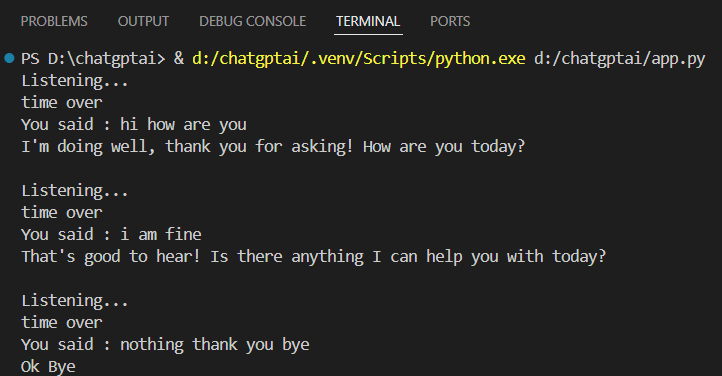

# Voice Assistant Using Gemini AI

The project takes voice input and converts it to text and gives text to gemini model through api request and gets the response. This response further converted as a Voice output.

## Cloning the Repository(VS Code)

create a folder anywhere in your system(I am doing it in D drive) and name it what ever you want(I am naming it voice_ai_assitant). After that type the below command in your terminal.

#### terminal

`D:\voice_ai_assitant> git clone https://github.com/SREENIVASAN-PRASANTH/Voice_assistant.git`

## API key
 
From the Google AI studio: https://aistudio.google.com/apikey .
you can sign in and get an API key.

After getting the key create a api_key.py file in your folder
and add create a variable and assign the api key to this variable.

#### api_key.py

`api_key = 'YOUR_API_KEY'`

## Creating Virtual Environment

Since you will be installing few libraries you need to create a virtual environment in which you install the required libraries and their respective version.

#### terminal

`pythom -m venv .venv`

this will create a .venv file in your folder. Now to activate the virtual environment you need to write below command.

#### terminal
`D:\voice_ai_assistant> cd .venv`

`D:\voice_ai_assistant\.venv> cd Scripts/activate`

now the terminal will look like:

`(.venv)D:\voice_ai_assistant\.venv>`

this means you have successfully created virtual environment. Now come back to main folder.

`(.venv)D:\voice_ai_assistant\.venv> cd ..`
`(.venv)D:\voice_ai_assistant>`

## Insatlling necessary libraries from `Requirements.txt` file
This will help you to downlaod all the libraries that are required for the project.

#### terminal
`(.venv)D:\voice_ai_assistant>pip install -r requirements.txt`

## Running the project
Now you have to run the app.py file from terminal

`(.venv)D:\voice_ai_assistant>python app.py`

## Sample Output
